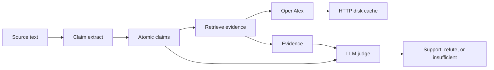

# ClaimForge

ClaimForge is a live scientific claim verifier. It will extract atomic claims
from text, retrieve literature that bears on them, and record an LLM judge's
verdict (support, refute, or insufficient evidence).

Day 1 is the scaffold and an OpenAlex smoke test. It does not extract claims
or call a model. The judge and the claim schema are later days.

## Why this shape

Scientific claims are only useful to check when the evidence path is
repeatable. OpenAlex is a public, keyless works catalog, so the first
network hop can be real without hiding a credential in the repo. Responses
are cached on disk because the same work lookup will be repeated by later
retrieval and eval runs, and because the public pool rate-limits anonymous
clients. The verifier itself stays a pipeline with three stages so the
extractor, the retriever, and the judge can be tested apart from each other.

## Architecture

Day 1 implements the cache and a works search. The other boxes are the
planned pipeline, not code that runs yet. See [docs/architecture.md](docs/architecture.md).



## Setup

Python 3.11 or newer.

```bash
python -m venv .venv
source .venv/bin/activate
pip install -e ".[dev]"
```

No API key is required. `.env.example` lists optional variables for later
days, including `CLAIMFORGE_LLM_*`. Day 1 does not load a dotenv file and
does not read those LLM variables. Set `CLAIMFORGE_OPENALEX_MAILTO` in the
environment only if you want OpenAlex's polite pool.

Cached HTTP bodies are written to `data/cache/` and gitignored. The directory
is kept with a short note so a fresh clone still has a place to write.

## Smoke run

```bash
claimforge smoke-openalex
```

That searches OpenAlex for `physics informed neural network` (`per_page=3`)
and prints titles and OpenAlex ids. Exit code 0 means the search succeeded.
The same entry point is `python -m claimforge smoke-openalex`.

```bash
claimforge smoke-openalex --query "graph neural network" --per-page 3
```

## Tests

Unit tests mock the HTTP transport. CI runs them on every pull request and
on pushes to `main`.

```bash
pytest -m "not integration"
```

The live OpenAlex check soft-skips when the network fails or the API returns
429 or a transient 5xx:

```bash
pytest -m integration
```

## Limitations

- Day 1 does not extract claims, fetch full text, rank evidence, or judge
  anything. The architecture diagram is a stub of that pipeline.
- The disk cache has no TTL and no size cap. Delete `data/cache` to refresh.
- Retries cover 429, 500, 502, 503, 504, and connection failures. Other HTTP
  statuses are returned to the caller.
- OpenAlex is used without an API key. A missing mailto uses the public pool,
  which can rate-limit. `Retry-After` is honored, then capped.
- No LLM provider is configured. Do not put keys in the repository.

## License

MIT. See [LICENSE](LICENSE).
