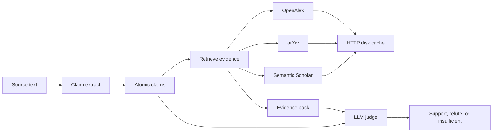

# ClaimForge

ClaimForge is a live scientific claim verifier. It will extract atomic claims
from text, retrieve literature that bears on them, and record an LLM judge's
verdict (support, refute, or insufficient evidence).

Day 1 is the scaffold and an OpenAlex smoke test. Day 2 extracts claims from
abstracts with a rule-based extractor that needs no API key. An optional LLM
path runs only when `CLAIMFORGE_LLM_*` is set. Day 3 retrieves evidence from
OpenAlex, arXiv, and Semantic Scholar. The judge is a later day.

## Why this shape

Scientific claims are only useful to check when the evidence path is
repeatable. OpenAlex is a public, keyless works catalog, so the first
network hop can be real without hiding a credential in the repo. Responses
are cached on disk because the same work lookup will be repeated by later
retrieval and eval runs, and because the public pool rate-limits anonymous
clients. The verifier itself stays a pipeline with three stages so the
extractor, the retriever, and the judge can be tested apart from each other.

## Architecture

Day 1 implements the cache and a works search. Day 2 implements claim
extraction from abstracts. Day 3 implements multi-source evidence retrieval.
Embedding rank and the judge are still planned. See
[docs/architecture.md](docs/architecture.md).



## Setup

Python 3.11 or newer.

```bash
python -m venv .venv
source .venv/bin/activate
pip install -e ".[dev]"
```

No API key is required for OpenAlex, arXiv, Semantic Scholar, or the default
extractor. `.env.example` lists optional variables. The package does not load
a dotenv file. Set `CLAIMFORGE_OPENALEX_MAILTO` only if you want OpenAlex's
polite pool. Set `CLAIMFORGE_S2_API_KEY` only if you have a Semantic Scholar
key; retrieval works without it. Set `CLAIMFORGE_LLM_API_KEY` and
`CLAIMFORGE_LLM_MODEL` only if you want extract-claims to call an
OpenAI-compatible chat endpoint. Leave them unset to stay on the rule
extractor.

Cached HTTP bodies are written to `data/cache/` and gitignored. The directory
is kept with a short note so a fresh clone still has a place to write.

## Smoke run

```bash
claimforge smoke-openalex
```

That searches OpenAlex for `physics informed neural network` (`per_page=3`)
and prints titles and OpenAlex ids. Exit code 0 means the search succeeded.
The same entry point is `python -m claimforge smoke-openalex`.

```bash
claimforge smoke-openalex --query "graph neural network" --per-page 3
```

## Extract claims

```bash
claimforge extract-claims --query "physics informed neural network"
```

That fetches a few OpenAlex works (default `per_page=3`) and prints a JSON
array of claims taken from their abstracts. The same flags as the smoke
command apply (`--per-page`, `--cache-dir`). With no LLM variables set, the
extractor is deterministic and does not call a model.

## Retrieve evidence

```bash
claimforge retrieve-evidence --text "Physics-informed neural networks reduce the error on the Burgers equation."
```

That queries OpenAlex, arXiv, and Semantic Scholar through the disk cache,
drops duplicate works, and prints a JSON array of evidence. `--top-k` and
`--per-source` default to 8.

A claim file from `extract-claims`, or a single claim object, works too:

```bash
claimforge retrieve-evidence --claim-json claims.json
```

One claim prints an evidence array. Several claims print
`{"claim_id", "evidence"}` objects. Semantic Scholar HTTP 401 and 429 become
an empty contribution. The command still prints whatever the other sources
returned. It exits 1 only when every source fails.

## Tests

Unit tests mock the HTTP transport. CI runs them on every pull request and
on pushes to `main`.

```bash
pytest -m "not integration"
```

Live OpenAlex and evidence-retrieval checks soft-skip when the network fails
or a provider returns 401, 429, or a transient 5xx:

```bash
pytest -m integration
```

## Limitations

- Extraction covers abstracts only. Cue patterns miss sentences that do not
  look like results, methods, or simple factual statements.
- Evidence retrieval returns abstracts or short snippets, not full text.
  `score` is lexical overlap. Day 4 adds an embedding ranker. The judge is
  not called.
- The disk cache has no TTL and no size cap. Delete `data/cache` to refresh.
- Retries cover 429, 500, 502, 503, 504, and connection failures. Other HTTP
  statuses are returned to the caller.
- OpenAlex, arXiv, and Semantic Scholar are used without an API key. A missing
  mailto uses the OpenAlex public pool, which can rate-limit. `Retry-After`
  is honored, then capped. Semantic Scholar 401 and 429 do not fail retrieval.
- No LLM provider is configured. Do not put keys in the repository.

## License

MIT. See [LICENSE](LICENSE).
