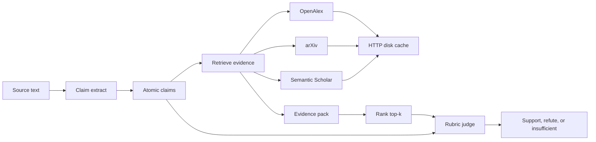

# ClaimForge

ClaimForge is a live scientific claim verifier. It will extract atomic claims
from text, retrieve literature that bears on them, and record an LLM judge's
verdict (support, refute, or insufficient evidence).

Day 1 is the scaffold and an OpenAlex smoke test. Day 2 extracts claims from
abstracts with a rule-based extractor that needs no API key. An optional LLM
path runs only when `CLAIMFORGE_LLM_*` is set. Day 3 retrieves evidence from
OpenAlex, arXiv, and Semantic Scholar. Day 4 re-scores that pack and keeps
the top matches. Day 5 judges the pack with a rubric and records support,
refute, or insufficient evidence. The same LLM variables can replace that
rubric. Leave them unset to stay on the rubric. Day 6 scores a frozen gold
fixture with the rubric and prints accuracy, per-label F1, and agreement.
That command does not use the network. Day 7 serves the same verify and
judge paths over HTTP, and `claimforge eval` can score a directory of
fixtures or several files in one run. Day 8 paces catalog hosts, skips a
catalog after repeated hard failures, rate-limits `POST /verify`, and adds
an offline mode that does not open a network connection.

## Why this shape

Scientific claims are only useful to check when the evidence path is
repeatable. OpenAlex is a public, keyless works catalog, so the first
network hop can be real without hiding a credential in the repo. Responses
are cached on disk because the same work lookup will be repeated by later
retrieval and eval runs, and because the public pool rate-limits anonymous
clients. The verifier itself stays a pipeline with three stages so the
extractor, the retriever, and the judge can be tested apart from each other.

## Architecture

Day 1 implements the cache and a works search. Day 2 implements claim
extraction from abstracts. Day 3 implements multi-source evidence retrieval.
Day 4 ranks the pack with a local embedding model or with TF-IDF cosine.
Day 5 judges that pack. Day 6 scores a gold fixture against that judge.
Day 7 is a small FastAPI service in front of verify, judge, and eval.
Day 8 adds host pacing, a per-source failure skip, a `/verify` rate limit,
and offline cassettes. See [docs/architecture.md](docs/architecture.md).



## Setup

Python 3.11 or newer.

```bash
python -m venv .venv
source .venv/bin/activate
pip install -e ".[dev]"
```

That install is the CI path. Evidence is ranked with TF-IDF cosine. No model
is downloaded.

To rank with a local sentence-transformers model (`all-MiniLM-L6-v2` by
default) as well:

```bash
pip install -e ".[dev,embeddings]"
```

`claimforge retrieve-evidence` then uses embeddings unless you pass
`--ranker lexical`. The first embedding run downloads the model into the
local Hugging Face cache and writes vectors under `data/cache/embeddings/`.

No API key is required for OpenAlex, arXiv, Semantic Scholar, the default
extractor, or either ranker. `.env.example` lists optional variables. The
package does not load a dotenv file. Set `CLAIMFORGE_OPENALEX_MAILTO` only if
you want OpenAlex's polite pool. Set `CLAIMFORGE_S2_API_KEY` only if you have
a Semantic Scholar key; retrieval works without it. Set
`CLAIMFORGE_EMBEDDING_MODEL` only to override the default MiniLM model. Set
`CLAIMFORGE_LLM_API_KEY` and `CLAIMFORGE_LLM_MODEL` only if you want
extract-claims, verify, or judge to call an OpenAI-compatible chat endpoint.
Leave them unset to stay on the rule extractor and the rubric judge.
`CLAIMFORGE_OFFLINE=1` forces verify and retrieve to skip the network.
`CLAIMFORGE_HTTP_MIN_INTERVAL_S` spaces outbound requests to one host.
`CLAIMFORGE_VERIFY_RATE_LIMIT` caps `POST /verify` in one process.

Cached HTTP bodies are written to `data/cache/` and gitignored. The directory
is kept with a short note so a fresh clone still has a place to write.

## Smoke run

```bash
claimforge smoke-openalex
```

That searches OpenAlex for `physics informed neural network` (`per_page=3`)
and prints titles and OpenAlex ids. Exit code 0 means the search succeeded.
The same entry point is `python -m claimforge smoke-openalex`.

```bash
claimforge smoke-openalex --query "graph neural network" --per-page 3
```

## Extract claims

```bash
claimforge extract-claims --query "physics informed neural network"
```

That fetches a few OpenAlex works (default `per_page=3`) and prints a JSON
array of claims taken from their abstracts. The same flags as the smoke
command apply (`--per-page`, `--cache-dir`). With no LLM variables set, the
extractor is deterministic and does not call a model.

## Retrieve evidence

```bash
claimforge retrieve-evidence --text "Physics-informed neural networks reduce the error on the Burgers equation."
```

That queries OpenAlex, arXiv, and Semantic Scholar through the disk cache,
drops duplicate works, re-scores them, and prints a JSON array of evidence.
Each record's `score` is cosine similarity from the active ranker, in
`[0, 1]`. Stderr names that ranker (`ranker: lexical` or
`ranker: embeddings`). `--top-k` and `--per-source` default to 8.

```bash
claimforge retrieve-evidence --text "..." --ranker lexical
claimforge retrieve-evidence --text "..." --ranker embeddings
```

`--ranker auto` is the default. It uses embeddings when the extra is
installed and TF-IDF otherwise. `--ranker embeddings` exits 1 without calling
the catalogs when sentence-transformers is not installed.

A claim file from `extract-claims`, or a single claim object, works too:

```bash
claimforge retrieve-evidence --claim-json claims.json
```

One claim prints an evidence array. Several claims print
`{"claim_id", "evidence"}` objects. Semantic Scholar HTTP 401 and 429 become
an empty contribution. The command still prints whatever the other sources
returned. It exits 1 only when every source fails.

## Verify a claim

```bash
claimforge verify --text "Physics-informed neural networks reduce the error on the Burgers equation."
```

That runs the same retrieval as `retrieve-evidence` and then the rubric
judge. Stdout is one verdict JSON object (`label`, `confidence`, `rationale`,
`evidence_ids`, `rubric_scores`). Stderr names the ranker. `--top-k`,
`--per-source`, `--ranker`, and `--claim-json` match `retrieve-evidence`.
With no LLM variables set, the judge does not call a model.

To score a saved pack without searching:

```bash
claimforge judge --claim-json claim.json --evidence-json evidence.json
```

`evidence.json` is a list of evidence objects for one claim. Several claims
need a list of `{"claim_id", "evidence"}` objects, or a map from claim id to
that list.

## Evaluate gold claims

```bash
claimforge eval --fixture tests/fixtures/gold_claims.json
```

That scores `tests/fixtures/gold_claims.json` with the rubric judge. The
fixture holds 13 claims. Each one includes an inline evidence pack, so the
command does not search OpenAlex, arXiv, or Semantic Scholar and does not
call a model. Stdout is metrics JSON (accuracy, per-label F1, agreement,
confusion, and each item). Stderr is a short table. Agreement equals accuracy
here: one judge, one gold label per item.

The command exits 0. `--strict` exits 1 when accuracy is below
`--min-accuracy`. The default bar is 1.0, and the committed fixture meets it.
A bad fixture exits 2.

```bash
claimforge eval --fixture tests/fixtures/gold_claims.json --strict
claimforge eval --fixture tests/fixtures/gold_claims.json --format json
```

`--fixture` also accepts several JSON files, repeated flags, or a directory.
A directory is scored as one batch: every `*.json` file in that directory,
not in subdirectories. Other files are ignored. Item ids must be unique
across the batch. One file behaves as before.

```bash
claimforge eval --fixture tests/fixtures
claimforge eval --fixture path/one.json path/two.json
claimforge eval --fixture path/one.json --fixture path/two.json
```

## HTTP API

`claimforge serve` runs the API on `127.0.0.1:8000`. The same app is
`uvicorn claimforge.api:app`. Interactive docs are at `/docs`. No API key
is required. `/verify` calls the catalogs through the disk cache. `/judge`
and `/eval` do not.

```bash
claimforge serve
uvicorn claimforge.api:app --host 127.0.0.1 --port 8000
```

```bash
curl -s http://127.0.0.1:8000/health
```

```bash
curl -s http://127.0.0.1:8000/verify \
  -H 'content-type: application/json' \
  -d '{"text":"Physics-informed neural networks reduce the error on the Burgers equation.","ranker":"lexical"}'
```

`ranker` is optional (`auto`, `lexical`, or `embeddings`). `auto` is the
default, same as the CLI. `top_k` and `per_source` default to 8. The body
is one verdict object. The ranker name is the `X-ClaimForge-Ranker` header.

To score a pack you already have, without searching:

```bash
curl -s http://127.0.0.1:8000/judge \
  -H 'content-type: application/json' \
  -d '{"claim":{"id":"clm_burgers","text":"Physics-informed neural networks reduce the error on the Burgers equation.","source_work_id":"claimforge:text","source_title":""},"evidence":[]}'
```

An empty pack is insufficient. A saved evidence list uses the same fields
as `claimforge judge`.

`POST /verify` is rate-limited in this process. The default is 60 requests
per 60 seconds. A full window returns HTTP 429:

```json
{"detail": "rate limit exceeded for /verify", "retry_after_s": 60.0}
```

`Retry-After` is the same wait in whole seconds. Set
`CLAIMFORGE_VERIFY_RATE_LIMIT=0` to disable it. `/health`, `/judge`, and
`/eval` are not limited.

## Offline mode

`CLAIMFORGE_OFFLINE=1` or `--offline` does not contact OpenAlex, arXiv, or
Semantic Scholar. `verify` and `retrieve-evidence` read a cassette whose
text matches the claim, or a response already stored in `data/cache`. If
neither exists, retrieve prints `[]` and verify prints an insufficient
verdict. Both exit 0.

```bash
claimforge verify --offline --ranker lexical --text "Physics-informed neural networks reduce the error on the Burgers equation."
```

That uses `data/fixtures/cassettes/burgers.json`. The passages are synthetic.
A different sentence, with an empty cache, is insufficient:

```bash
CLAIMFORGE_OFFLINE=1 claimforge verify --ranker lexical --text "This sentence has no cassette."
```

`claimforge serve --offline` sets the same variable for `/verify`. Cassettes
live in `CLAIMFORGE_FIXTURE_DIR` (default `data/fixtures/cassettes`). Gold
eval does not read them. Online verify does not read them either.

Offline eval, from a fixture path or from inline items:

```bash
curl -s http://127.0.0.1:8000/eval \
  -H 'content-type: application/json' \
  -d '{"fixture":"tests/fixtures/gold_claims.json"}'
```

The body is the same metrics object as `claimforge eval`. A path may be one
JSON file or a directory of JSON fixtures. Pass `items` instead of `fixture`
to score objects inline. A score below `min_accuracy` is still HTTP 200;
`meets_threshold` is in the JSON. `--strict` remains a CLI exit code.
`/eval` always uses the rubric.

## Tests

Unit tests mock the HTTP transport and score with the lexical ranker. They
do not download a model. A MiniLM test is skipped unless the embeddings
extra is installed. CI runs the unit tests on every pull request and on
pushes to `main`, and it does not install `[embeddings]`.

```bash
pytest -m "not integration"
```

Live OpenAlex and evidence-retrieval checks soft-skip when the network fails
or a provider returns 401, 429, or a transient 5xx:

```bash
pytest -m integration
```

## Limitations

- Extraction covers abstracts only. Cue patterns miss sentences that do not
  look like results, methods, or simple factual statements.
- Evidence retrieval returns abstracts or short snippets, not full text.
  `score` is embedding cosine when sentence-transformers is installed, and
  TF-IDF cosine otherwise. The default judge reads those scores and a small
  cue list. It misses paraphrases that do not share claim terms or a listed
  cue, and a high score with no cue stays insufficient.
- Gold eval scores the frozen fixture with the rubric. Passages are
  synthetic. The set locks this judge; it is not a human-annotated corpus.
  `--strict` exits 1 when accuracy is below 1.0. Without `--strict` the
  command still prints metrics and exits 0. A directory of fixtures is one
  batch. Ids must stay unique across those files.
- `POST /verify` allows 60 requests per 60 seconds in one process. The body
  of a rejection is JSON and the status is 429. There is still no auth.
  `/eval` with `fixture` reads a local path. Bind the server to localhost
  unless you mean to expose it.
- A catalog that fails 3 times in a row in one process is skipped until that
  process exits. `CLAIMFORGE_SOURCE_FAILURE_LIMIT=0` disables the skip.
  Semantic Scholar HTTP 401 and 429 stay empty contributions and do not
  count toward the skip.
- Offline mode reads cassettes and the disk cache only. It does not refresh
  a stale cache. Delete `data/cache` and leave offline mode to fetch again.
- The disk cache has no TTL and no size cap. Delete `data/cache` to refresh.
- Retries cover 429, 500, 502, 503, 504, and connection failures. Other HTTP
  statuses are returned to the caller.
- OpenAlex, arXiv, and Semantic Scholar are used without an API key. A missing
  mailto uses the OpenAlex public pool, which can rate-limit. `Retry-After`
  is honored, then capped. Semantic Scholar 401 and 429 do not fail retrieval.
- No LLM provider is required. `verify` and `judge` use the rubric unless
  both `CLAIMFORGE_LLM_API_KEY` and `CLAIMFORGE_LLM_MODEL` are set. Do not
  put keys in the repository.

## License

MIT. See [LICENSE](LICENSE).
