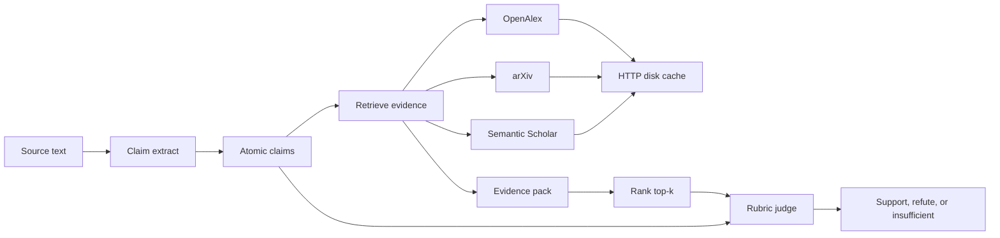
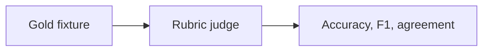
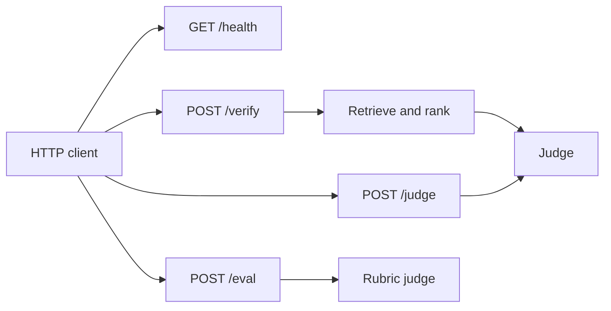

# Architecture

ClaimForge checks a scientific claim against the literature and records a
verdict. Day 1 shipped the project skeleton and a cached OpenAlex client.
Day 2 adds the claim schema and an abstract extractor. Day 3 retrieves an
evidence pack from OpenAlex, arXiv, and Semantic Scholar. Day 4 re-scores
that pack with a local embedding model when it is installed, and with TF-IDF
cosine otherwise, then keeps the top matches. Day 5 judges that pack with a
deterministic rubric. An optional LLM judge runs only when both
`CLAIMFORGE_LLM_API_KEY` and `CLAIMFORGE_LLM_MODEL` are set. Day 6 scores a
frozen gold fixture with that rubric and reports accuracy, per-label F1, and
agreement. The eval path does not use the network. Day 7 serves verify,
judge, and that eval over HTTP, and the eval CLI accepts a directory of
fixtures or several files. Day 8 paces catalog hosts, skips a catalog after
repeated hard failures, rate-limits `POST /verify`, and adds an offline mode
that never opens a socket.

## Pipeline



| Stage | State | Role |
| --- | --- | --- |
| Claim extract | Shipped (Day 2) | Turn an abstract into atomic claims with a stable schema. |
| Retrieve | Shipped (Day 3) | Query OpenAlex, arXiv, and Semantic Scholar. Deduplicate catalog copies. |
| Rank | Shipped (Day 4) | Re-score the pack with embedding cosine or TF-IDF cosine and keep top-k. |
| HTTP disk cache | Shipped (Day 1) | Cache GET responses under `data/cache` and retry 429 / transient 5xx. |
| Host interval | Shipped (Day 8) | Optional minimum gap between outbound GETs to one host. Cache hits do not wait. |
| Source skip | Shipped (Day 8) | After N consecutive hard failures in this process, skip that catalog. |
| Offline mode | Shipped (Day 8) | Cassette or warm cache only. A miss is an empty pack, then insufficient. |
| Verify rate limit | Shipped (Day 8) | In-process fixed window on `POST /verify`. HTTP 429 JSON. |
| Judge | Shipped (Day 5) | Rubric verdict over the top-k pack. Optional LLM when both key and model are set. |
| Eval | Shipped (Day 6) | Score frozen gold fixtures with the rubric. One file, several files, or a directory. Accuracy, per-label F1, and agreement. No network. |
| API | Shipped (Day 7) | FastAPI: `GET /health`, `POST /verify`, `POST /judge`, `POST /eval`. |

## HTTP cache

`claimforge.http_cache.CachedHttpClient` performs GET requests with the
standard-library client.

- The cache key is the SHA-256 of `GET` plus a canonical URL. Scheme and host
  are lowercased, query parameters are decoded and sorted, and the fragment is
  dropped. Parameter order does not change the key.
- Successful responses (HTTP 200–299) are stored as JSON. The body is base64.
  Files are written to a temporary sibling and renamed into place.
- HTTP 429 and 500, 502, 503, and 504 are retried. `Retry-After` (delta-seconds
  or HTTP-date) sets the wait when it parses. Otherwise the client uses
  exponential backoff. The wait is capped.
- Connection failures and timeouts are retried the same way, without a cache
  write.
- Other statuses, including 404, are returned to the caller and not cached.
- A corrupt cache file is ignored and the request is sent again.
- `CLAIMFORGE_HTTP_MIN_INTERVAL_S` is an optional minimum gap, in seconds,
  between outbound GETs to the same host. Unset or `0` adds no delay. The
  gap is shared by every client in the process, so `claimforge serve` paces
  OpenAlex, arXiv, and Semantic Scholar across requests. A cache hit does
  not wait and does not count. Retries wait again before the next attempt.
- Offline mode does not call the transport. A cache hit is returned. A cache
  miss raises `OfflineCacheMiss`. That error is a soft failure named
  `offline`. It does not increment the source-skip counter.

OpenAlex needs no API key. The client sends a project User-Agent. If
`CLAIMFORGE_OPENALEX_MAILTO` is set, the works search adds it as `mailto` so
the call can use the polite pool. That value is optional and is not a secret.

## OpenAlex smoke

`claimforge smoke-openalex` calls `GET https://api.openalex.org/works` with
`search`, `per_page` (default 3), and `select=id,display_name`. It prints each
title and OpenAlex id and exits 0 when the search succeeds.

## Claim schema

`claimforge.models.Claim` is a frozen Pydantic model. Extra fields are
rejected. The JSON form uses plain strings and numbers:

| Field | Required | Notes |
| --- | --- | --- |
| `id` | yes | Stable `clm_` plus a short hash of the work id, order, and text. |
| `text` | yes | One claim sentence. |
| `source_work_id` | yes | OpenAlex work id. |
| `source_title` | yes | May be an empty string when the work has no title. |
| `confidence` | no | Float in `[0, 1]`, or null. |
| `claim_type` | no | `factual`, `method`, `result`, `other`, or null. |

## Extractor

`claimforge.extract.extract_claims_from_abstract` splits an abstract into
sentences and keeps sentences that match claim cues (`we show`, `results`,
`findings`, `demonstrates`, `evidence that`, method phrases such as
`we propose` and `our method`, and a few factual patterns). It does not need
an API key.

`extract_from_openalex_work` reads a work dict. It uses a string `abstract`
when one is present, otherwise it rebuilds prose from
`abstract_inverted_index`.

`claimforge extract-claims --query "..."` reuses the Day 1 cached OpenAlex
client, requests `id`, `display_name`, and `abstract_inverted_index`, and
prints a JSON array of claims. `claimforge smoke-openalex` is unchanged and
still selects only ids and titles.

Optional LLM extraction runs only when both `CLAIMFORGE_LLM_API_KEY` and
`CLAIMFORGE_LLM_MODEL` are set. The client speaks OpenAI-compatible chat
completions (`CLAIMFORGE_LLM_BASE_URL`, default `https://api.openai.com/v1`).
Set `CLAIMFORGE_LLM_PROVIDER=rules` to force the rule path. If the LLM call
fails, extraction falls back to the rules. Unset variables skip the LLM.

## Evidence retrieval

`claimforge.retrieve.retrieve_evidence` takes a `Claim` or raw claim text and
returns the top evidence after merging three catalogs. Every request uses
`CachedHttpClient`, including Atom XML from arXiv. No API key is required.

| Source | Role | Endpoint |
| --- | --- | --- |
| OpenAlex | Primary | `GET https://api.openalex.org/works` with `search` and `EVIDENCE_SELECT` (`id`, `display_name`, `doi`, `ids`, `abstract_inverted_index`). Optional `CLAIMFORGE_OPENALEX_MAILTO` joins the polite pool. |
| arXiv | Free, no key | `GET https://export.arxiv.org/api/query` (Atom XML). Content terms are AND-ed. |
| Semantic Scholar | Secondary | `GET https://api.semanticscholar.org/graph/v1/paper/search`, unauthenticated. Optional `CLAIMFORGE_S2_API_KEY` is sent as `x-api-key` and is never put in the URL or required in CI. |

Semantic Scholar answers HTTP 401 and 403 (`rejected`) and HTTP 429
(`rate_limited`) with an empty contribution so a rate limit does not fail
the command or CI. Those empty contributions are not hard failures.

Hard failures are classified and then skipped for that catalog only:

| Kind | When |
| --- | --- |
| `rate_limited` | HTTP 429 that exhausted retries, or a message that names HTTP 429. |
| `rejected` | HTTP 401 or 403 that is not already the Semantic Scholar empty contribution. |
| `unavailable` | Timeout, connection error, or HTTP 500, 502, 503, or 504. |
| `invalid_response` | Any other error, including a bad payload or an unexpected exception. |
| `offline` | Cache miss while offline mode is on. |

An unexpected exception in one catalog is `invalid_response`. The other
catalogs are still returned. `verify` and `serve` stay up. The CLI exits 1,
and `POST /verify` returns HTTP 502, only when every catalog fails in online
mode. Offline mode returns an empty pack instead of that error.

After `CLAIMFORGE_SOURCE_FAILURE_LIMIT` consecutive hard failures for one
catalog in this process (default 3), later retrievals skip that catalog for
the rest of the process. In a multi-claim `verify` or `retrieve-evidence`
command, that is the rest of the call. In `claimforge serve`, the skip lasts
until the process exits. A successful response resets the streak before the
limit is reached. `offline` misses do not count. Semantic Scholar 401, 403,
and 429 do not count, because that client already turned them into an empty
contribution. The counter is memory only. `0` disables the skip. Restart the
process to contact a skipped catalog again.

Duplicates collapse when they share a DOI or an arXiv id (version suffixes
ignored). Identifiers are copied onto one record. OpenAlex wins the `source`
and `url` when it is one of the copies, and the longer abstract is kept. A
shared title merges only when one copy has no DOI, arXiv id, or work id.

`score` is cosine similarity from the active ranker, clipped to `[0, 1]`.
Negative cosine values are stored as 0. The retriever does not fetch full text.
Day 3 term overlap (`lexical_score`) is no longer the pack score.

## Evidence schema

`claimforge.models.Evidence` is a frozen Pydantic model. Extra fields are
rejected.

| Field | Required | Notes |
| --- | --- | --- |
| `id` | yes | `ev_` plus a short hash. DOI, then arXiv id, then work id, then title. |
| `title` | yes | May be empty when the source has no title. |
| `snippet` | yes | Abstract when the source returned one, otherwise a short snippet. May be empty. |
| `source` | yes | `openalex`, `arxiv`, or `semantic_scholar`. |
| `work_id` | no | OpenAlex work URL, or a Semantic Scholar paper id. |
| `doi` | no | Bare DOI, without a `https://doi.org/` prefix. |
| `arxiv_id` | no | arXiv id without a version suffix. |
| `url` | yes | Catalog URL for the preferred source. |
| `score` | no | Cosine similarity in `[0, 1]` after ranking, or null before it. |

`claimforge retrieve-evidence --text "..."` prints a JSON array of evidence.
`--claim-json path` reads one claim object, or a list such as `extract-claims`
output. One claim prints the same array. Several claims print
`{"claim_id", "evidence"}` objects. `--top-k` and `--per-source` default to 8
and must be from 1 to 25. `--ranker` is `auto` (default), `lexical`, or
`embeddings`. Stdout is the JSON pack, including each record's `score`.
Stderr is one line, `ranker: lexical` or `ranker: embeddings`.

arXiv requests send `User-Agent: ClaimForge/0.1 (mailto:github.com/shehbaz0101/claimforge)`
and `Accept: application/atom+xml`. A 406 or other arXiv failure is still a
soft failure: the other catalogs are returned.

## Evidence ranking

`claimforge.rank` re-scores the deduplicated pack and `pack_top_k` keeps the
highest scores for the future judge. Ties break toward OpenAlex, then
Semantic Scholar, then arXiv.

| Ranker | When | Score |
| --- | --- | --- |
| `embeddings` | `pip install -e ".[embeddings]"`, or `--ranker embeddings` | Cosine similarity of a local sentence-transformers model. Default model `all-MiniLM-L6-v2`. Override with `CLAIMFORGE_EMBEDDING_MODEL`. |
| `lexical` | Default in CI, and `--ranker lexical` | TF-IDF cosine over the candidate pack. Title tokens are repeated so a title hit outweighs a snippet hit. No extra dependency and no network. |
| `auto` | `retrieve_evidence` and the CLI default | Embeddings when `sentence-transformers` imports, otherwise lexical. The model is not imported on the lexical path. |

Embedding vectors are JSON files under `data/cache/embeddings/<model>/`.
The file name is the SHA-256 of the model name and the text. A corrupt file
is ignored and encoded again. The cache is gitignored with the rest of
`data/cache`. CI installs `.[dev]` only, so unit tests stay on the lexical
ranker and do not download a model.

`--ranker embeddings` fails before any catalog request when the extra is
missing. `retrieve_evidence(..., ranker="lexical")` forces the offline path.

## Verdict

`claimforge.models.Verdict` is a frozen Pydantic model. Extra fields are
rejected. `judge_claim(claim, evidence)` returns one verdict. The default
path is `rubric_verdict`, which does not read the environment and does not
call a model.

| Field | Required | Notes |
| --- | --- | --- |
| `claim_id` | yes | The claim id. `claimforge verify --text` hashes the text into a `clm_` id and sets `source_work_id` to `claimforge:text`. |
| `label` | yes | `support`, `refute`, or `insufficient`. |
| `confidence` | yes | Confidence in that label, in `[0, 1]`. |
| `rationale` | yes | Short explanation, at most 500 characters. |
| `evidence_ids` | yes | Ids of the packed evidence, in pack order. Empty when nothing was packed. |
| `rubric_scores` | yes | Map of criterion to a float, or null when that criterion was not scored. |

The rubric always writes three scores:

| Criterion | Range | Rule |
| --- | --- | --- |
| `relevance` | `[0, 1]` | Average of the max and the mean ranker `score` on the pack. Scores above 1 are clipped. Missing scores are ignored. No scores means 0. |
| `coverage` | `[0, 1]` | Average of two ratios, each capped at 1: non-empty snippets divided by 2, and distinct catalogs among those snippets divided by 2. Two snippets from two catalogs score 1. One snippet from one catalog scores 0.5. Empty snippets do not count. |
| `stance_lexical` | `[-1, 1]` | Weighted mean of per-snippet votes. A snippet votes only when it shares claim terms. Support phrases and an unnegated claim verb (`reduce`, `increase`, `improve`, and a few opposites) vote `+1`. Refute phrases, a negated claim verb, or an unnegated opposite vote `-1`. Anything else votes `0` and pulls the mean toward the middle. Ranker scores are the weights. A missing score weighs 1. A zero score does not vote. The title is not read. |

Thresholds are inclusive.

- **Support** when `relevance >= 0.55`, `coverage >= 0.75`, and `stance_lexical >= 0.20`.
- **Refute** when `stance_lexical <= -0.20` and `relevance >= 0.35`. Coverage is not required.
- **Insufficient** otherwise, including an empty pack, a high-scoring pack with no stance cues, a support lean that fails coverage or relevance, and a refute lean whose relevance is below 0.35.

`claimforge verify --text "..."` reuses Day 3/4 retrieval (`retrieve_evidence`, including `--top-k`, `--per-source`, `--ranker`, and the disk cache) and then judges. Stdout is one verdict object. Several claims from `--claim-json` print a JSON array. Stderr is `ranker: lexical` or `ranker: embeddings`, same as `retrieve-evidence`. The command exits 1 when every catalog fails.

`claimforge judge --claim-json claims.json --evidence-json evidence.json` does not use the network. One claim accepts an evidence list or one evidence object. Several claims accept a `claim_id` to list map, or a list of `{"claim_id", "evidence"}` objects.

Optional LLM judging uses the same gate as extraction. Both `CLAIMFORGE_LLM_API_KEY` and `CLAIMFORGE_LLM_MODEL` must be set. `CLAIMFORGE_LLM_PROVIDER=rules` forces the rubric. The client speaks OpenAI-compatible chat completions (`CLAIMFORGE_LLM_BASE_URL`, default `https://api.openai.com/v1`). If the call fails or the body does not match the verdict schema, the rubric verdict is returned. Unset variables skip the model, so unit tests and CI stay offline. No key is written to the verdict or the log line.

## Gold eval

`claimforge.eval` scores a frozen fixture with `rubric_verdict`. It does not
call `retrieve_evidence`, and it does not read `CLAIMFORGE_LLM_*`. A configured
model cannot change the metrics or open a connection. CI runs this path with
`pytest -m "not integration"`. There is no live eval test: the packs are
inline, so a catalog call would not change the score.

The committed fixture is `tests/fixtures/gold_claims.json` (13 items).
`data/fixtures/README.md` points at that file. Each item has an id, an
`expected_label` (`support`, `refute`, or `insufficient`), a `Claim`, and an
`evidence` list. Passages are synthetic illustrations of the rubric, not
copied abstracts. An empty list is a valid pack. A bare JSON list of items is
also accepted. Unknown fields are rejected.

```bash
claimforge eval --fixture tests/fixtures/gold_claims.json
```

Stdout is a metrics JSON object. Stderr is a short table (`--format both`,
the default). `--format json` and `--format table` print one of the two.
The report includes:

| Field | Meaning |
| --- | --- |
| `accuracy` | Correct labels divided by the number of items. |
| `agreement_rate` | The same fraction. One judge and one gold label per item, so raw agreement equals accuracy. Both names are in the report. |
| `per_label` | Precision, recall, and F1 for `support`, `refute`, and `insufficient`. A rate is null when its denominator is zero. F1 is null unless both precision and recall are defined. |
| `macro_f1` | Mean of the defined per-label F1 values. Labels that were neither gold nor predicted are left out. |
| `confusion` | Gold label by predicted label. |
| `items` | Per-item expected label, predicted label, match, and confidence. |
| `meets_threshold` | True when `accuracy >= min_accuracy`. The comparison is inclusive. |

The command exits 0 after a successful run. `--strict` exits 1 when accuracy
is below `--min-accuracy`. The default bar is **1.0**, because every label in
the committed fixture matches the rubric. A bad fixture or a bad flag exits 2,
same as the other commands. Metrics are still printed when `--strict` fails.

```bash
claimforge eval --fixture tests/fixtures/gold_claims.json --strict
claimforge eval --fixture tests/fixtures/gold_claims.json --strict --min-accuracy 0.8
```

`--fixture` takes one or more paths. A directory contributes each `*.json`
file in that directory, sorted by file name. It does not walk subdirectories.
Other files are ignored. A directory with no JSON files is an error (exit 2).
Several files, or repeated `--fixture` flags, are one batch: items are
concatenated in the order given, and a directory's files stay in name order
inside that path. Gold ids must be unique across the batch. The report's
`fixture` field is the single path you passed, or the paths joined by `, `.
One file is unchanged: `fixture` is that path string, and the metrics are
the metrics for that file.

```bash
claimforge eval --fixture tests/fixtures
claimforge eval --fixture a.json b.json
claimforge eval --fixture a.json --fixture b.json
```



## HTTP API

`claimforge.api:app` is a FastAPI app. `claimforge serve` runs it with
uvicorn on `127.0.0.1:8000`. `uvicorn claimforge.api:app` is the same app.
`/docs` is the generated OpenAPI UI. FastAPI and uvicorn are install
dependencies, so `pip install -e ".[dev]"` is enough. Tests use
`fastapi.testclient.TestClient` and do not bind a port.

| Method | Path | Network | Body |
| --- | --- | --- | --- |
| `GET` | `/health` | none | `{"status": "ok", "version": "..."}` |
| `POST` | `/verify` | catalogs, or none when offline | `{"text", optional "ranker", "top_k", "per_source", "cache_dir"}` |
| `POST` | `/judge` | none | `{"claim", "evidence"}` |
| `POST` | `/eval` | none; local file read when `fixture` is set | `{"fixture"}` or `{"items"}`, optional `min_accuracy` |

`/verify` builds a claim with `claim_from_text`, calls `retrieve_evidence`,
then `judge_claim`. `ranker` is `auto` (default), `lexical`, or `embeddings`.
`top_k` and `per_source` are 1–25 and default to 8. `CLAIMFORGE_OPENALEX_MAILTO`
and `CLAIMFORGE_S2_API_KEY` are read the same way as the CLI. The response
body is one verdict object. `X-ClaimForge-Ranker` names the ranker. A missing
embedding extra is HTTP 422 and does not call a catalog. Every catalog
failing in online mode is HTTP 502 JSON. An unexpected retrieval exception
is also HTTP 502 JSON (`evidence retrieval failed`), not an unhandled crash.
A bad body is HTTP 422.

`POST /verify` is the only rate-limited route. The limiter is a fixed window
in this process. The default is 60 requests per 60 seconds, which is enough
for local use. `CLAIMFORGE_VERIFY_RATE_LIMIT` is the count. `0` disables the
limit. `CLAIMFORGE_VERIFY_RATE_WINDOW_S` is the window length (default 60).
When the window is full the response is HTTP 429:

```json
{"detail": "rate limit exceeded for /verify", "retry_after_s": 60.0}
```

`Retry-After` is that wait in whole seconds. `/health`, `/judge`, and
`/eval` are not counted. The limiter resets when the process exits.

`/judge` calls `judge_claim` on the posted claim and evidence list. An empty
list is a valid pack. It does not call `retrieve_evidence`. The optional LLM
judge still follows the Day 5 gate. Unset `CLAIMFORGE_LLM_*` stays on the
rubric.

`/eval` calls `evaluate_gold`, which always uses `rubric_verdict`. `fixture`
is one JSON file or a directory of JSON fixtures, the same expansion as the
CLI. `items` is a list of gold objects, the same schema as a fixture file.
Send one of those, not both. The response is the metrics object, including
`meets_threshold`. Accuracy below `min_accuracy` stays HTTP 200. `--strict`
is only a CLI exit code. A bad fixture is HTTP 422. `fixture` reads a path
on the server machine. The process is meant to bind to localhost.

```bash
claimforge serve
uvicorn claimforge.api:app --host 127.0.0.1 --port 8000
```



## Offline mode

`CLAIMFORGE_OFFLINE=1`, or `--offline` on `verify`, `retrieve-evidence`, and
`serve`, forces no network. `serve --offline` exports the variable before
uvicorn starts so a reload child sees it.

`verify` and `retrieve-evidence` then use, in order:

1. A cassette whose `id` matches the claim id, or whose `text` matches the
   claim text after case and whitespace are folded. Files are `*.json` in
   `CLAIMFORGE_FIXTURE_DIR` (default `data/fixtures/cassettes`), not in
   subdirectories. The shipped example is `burgers.json`. Passages are
   synthetic. A bad file is skipped.
2. The HTTP disk cache, for a claim the cassette does not cover. A hit is
   used. A miss does not call the host.
3. An empty pack when neither source has the claim. `retrieve-evidence`
   prints `[]` and exits 0. `verify` and `POST /verify` judge that pack and
   return `insufficient` with HTTP 200. They do not exit 1 and they do not
   return HTTP 502 for the miss.

Online retrieval does not read cassettes. `claimforge eval` still reads gold
fixtures, not cassettes, and still does not search.

```bash
CLAIMFORGE_OFFLINE=1 claimforge verify --text "Physics-informed neural networks reduce the error on the Burgers equation." --ranker lexical
claimforge retrieve-evidence --offline --text "Physics-informed neural networks reduce the error on the Burgers equation." --ranker lexical
```

## Planned components

- **Demo polish (Day 9).** Sample outputs, a short demo path, and pre-commit lint if it is still missing.
- **Evidence store.** Hold the passages the judge is allowed to see.
