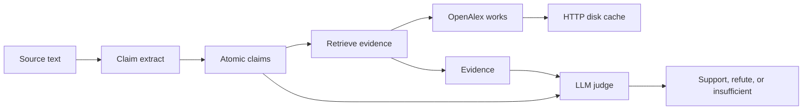

# Architecture

ClaimForge will check a scientific claim against the literature and record an
LLM judge's verdict. Day 1 shipped the project skeleton and a cached OpenAlex
client. Day 2 adds the claim schema and an abstract extractor. Retrieval
ranking and judging are not built yet.

## Pipeline

| Stage | State | Role |
| --- | --- | --- |
| Claim extract | Shipped (Day 2) | Turn an abstract into atomic claims with a stable schema. |
| Retrieve | Smoke only | Search OpenAlex works. No passage ranking or full-text fetch yet. |
| HTTP disk cache | Shipped (Day 1) | Cache GET responses under `data/cache` and retry 429 / transient 5xx. |
| LLM judge | Planned | Score a claim against retrieved evidence. No judge is called. |

## HTTP cache

`claimforge.http_cache.CachedHttpClient` performs GET requests with the
standard-library client.

- The cache key is the SHA-256 of `GET` plus a canonical URL. Scheme and host
  are lowercased, query parameters are decoded and sorted, and the fragment is
  dropped. Parameter order does not change the key.
- Successful responses (HTTP 200–299) are stored as JSON. The body is base64.
  Files are written to a temporary sibling and renamed into place.
- HTTP 429 and 500, 502, 503, and 504 are retried. `Retry-After` (delta-seconds
  or HTTP-date) sets the wait when it parses. Otherwise the client uses
  exponential backoff. The wait is capped.
- Connection failures and timeouts are retried the same way, without a cache
  write.
- Other statuses, including 404, are returned to the caller and not cached.
- A corrupt cache file is ignored and the request is sent again.

OpenAlex needs no API key. The client sends a project User-Agent. If
`CLAIMFORGE_OPENALEX_MAILTO` is set, the works search adds it as `mailto` so
the call can use the polite pool. That value is optional and is not a secret.

## OpenAlex smoke

`claimforge smoke-openalex` calls `GET https://api.openalex.org/works` with
`search`, `per_page` (default 3), and `select=id,display_name`. It prints each
title and OpenAlex id and exits 0 when the search succeeds.

## Claim schema

`claimforge.models.Claim` is a frozen Pydantic model. Extra fields are
rejected. The JSON form uses plain strings and numbers:

| Field | Required | Notes |
| --- | --- | --- |
| `id` | yes | Stable `clm_` plus a short hash of the work id, order, and text. |
| `text` | yes | One claim sentence. |
| `source_work_id` | yes | OpenAlex work id. |
| `source_title` | yes | May be an empty string when the work has no title. |
| `confidence` | no | Float in `[0, 1]`, or null. |
| `claim_type` | no | `factual`, `method`, `result`, `other`, or null. |

## Extractor

`claimforge.extract.extract_claims_from_abstract` splits an abstract into
sentences and keeps sentences that match claim cues (`we show`, `results`,
`findings`, `demonstrates`, `evidence that`, method phrases such as
`we propose` and `our method`, and a few factual patterns). It does not need
an API key.

`extract_from_openalex_work` reads a work dict. It uses a string `abstract`
when one is present, otherwise it rebuilds prose from
`abstract_inverted_index`.

`claimforge extract-claims --query "..."` reuses the Day 1 cached OpenAlex
client, requests `id`, `display_name`, and `abstract_inverted_index`, and
prints a JSON array of claims. `claimforge smoke-openalex` is unchanged and
still selects only ids and titles.

Optional LLM extraction runs only when both `CLAIMFORGE_LLM_API_KEY` and
`CLAIMFORGE_LLM_MODEL` are set. The client speaks OpenAI-compatible chat
completions (`CLAIMFORGE_LLM_BASE_URL`, default `https://api.openai.com/v1`).
Set `CLAIMFORGE_LLM_PROVIDER=rules` to force the rule path. If the LLM call
fails, extraction falls back to the rules. Unset variables skip the LLM.

## Planned components

These names describe later days. They have no modules yet.

- **Retriever (Day 3).** Multi-source evidence retrieval: turn a claim into
  queries and keep the works that can support or refute it.
- **Evidence store.** Hold the passages the judge is allowed to see.
- **Judge.** An LLM-as-judge prompt with a constrained verdict.
- **Eval harness.** Frozen claims, expected labels, and a score report.
