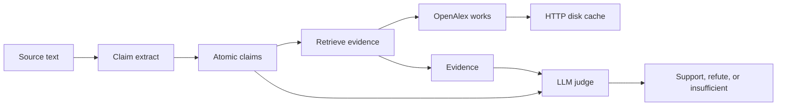

# Architecture

ClaimForge will check a scientific claim against the literature and record an
LLM judge's verdict. Day 1 only ships the project skeleton and a cached
OpenAlex client. Extraction, retrieval ranking, and judging are not built yet.

## Pipeline

| Stage | Day 1 state | Role |
| --- | --- | --- |
| Claim extract | Planned (Day 2) | Turn source text into atomic claims with a stable schema. |
| Retrieve | Smoke only | Search OpenAlex works. No passage ranking or full-text fetch yet. |
| HTTP disk cache | Shipped | Cache GET responses under `data/cache` and retry 429 / transient 5xx. |
| LLM judge | Planned | Score a claim against retrieved evidence. No model is called on Day 1. |

## HTTP cache

`claimforge.http_cache.CachedHttpClient` performs GET requests with the
standard-library client.

- The cache key is the SHA-256 of `GET` plus a canonical URL. Scheme and host
  are lowercased, query parameters are decoded and sorted, and the fragment is
  dropped. Parameter order does not change the key.
- Successful responses (HTTP 200–299) are stored as JSON. The body is base64.
  Files are written to a temporary sibling and renamed into place.
- HTTP 429 and 500, 502, 503, and 504 are retried. `Retry-After` (delta-seconds
  or HTTP-date) sets the wait when it parses. Otherwise the client uses
  exponential backoff. The wait is capped.
- Connection failures and timeouts are retried the same way, without a cache
  write.
- Other statuses, including 404, are returned to the caller and not cached.
- A corrupt cache file is ignored and the request is sent again.

OpenAlex needs no API key. The client sends a project User-Agent. If
`CLAIMFORGE_OPENALEX_MAILTO` is set, the works search adds it as `mailto` so
the call can use the polite pool. That value is optional and is not a secret.

## OpenAlex smoke

`claimforge smoke-openalex` calls `GET https://api.openalex.org/works` with
`search`, `per_page` (default 3), and `select=id,display_name`. It prints each
title and OpenAlex id and exits 0 when the search succeeds.

## Planned components

These names describe later days. They have no modules yet.

- **Claim schema.** Fields for the claim text, source span, and entity hints.
- **Extractor.** Map a paragraph or abstract to a list of claims.
- **Retriever.** Turn a claim into OpenAlex queries and keep the works that
  can support or refute it.
- **Evidence store.** Hold the passages the judge is allowed to see.
- **Judge.** An LLM-as-judge prompt with a constrained verdict.
- **Eval harness.** Frozen claims, expected labels, and a score report.

Day 2's first task is the claim schema and extractor. It should not depend on
a live model or on the judge.
